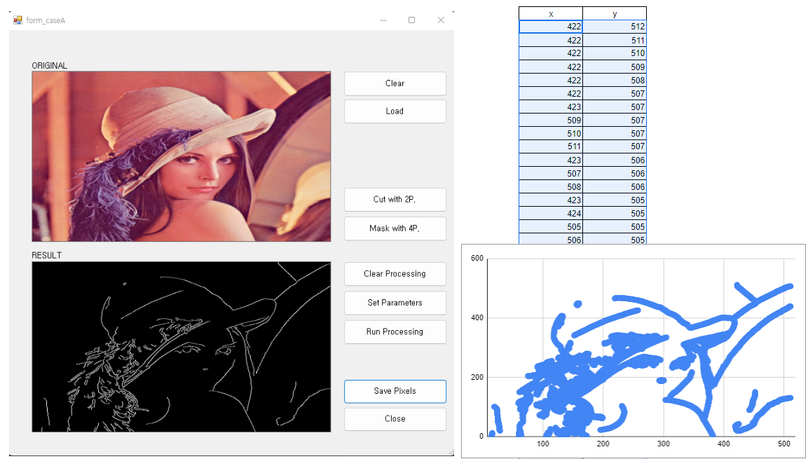

# 📺Desktop App for IMG Processing.
This is What the app does. 😂

I wrote a scatter chart for the output file(csv format).

It looks super same with what my app processing.🤤

## 🖼Main Features and IMG Processing Flow.
1. Load IMG
2. Cutting IMG
3. Masking IMG
4. Do CannyEdge Calculation
5. Get the Pixel Position Processed.
6. Save Pixel Position with CSV Format.
**2)~3) is optional.**

### 🖱️Mouse Event Features
***Common rule : If you want to Fix the selected status, Just Press middle button of mouse and Hit the Spacebar key. ⌨️***
* CuttingIMG✂️ : Picking 2 Points from left top to right bottom, A rectangle area will be working area for next  processing.

* Masking IMG 😷 : Pickng 4 Point either clock-wise or counter clock-wise direction, a polygon area which has 4 lines make Masking zone.

## ⚙️Development Environment
* OS : Windows
* Languages : `C#`
* IMG Processing Library : `OpenCVSharp`

## 📃Prerequisite
* Reference files(dll) : OpenCvSharp*
	* `OpenCvSharp.dll`
	* `OpenCvSharp.Extensions.dll`
	* `OpenCvSharpExtern.dll`
	* You can get these in [here](https://github.com/shimat/opencvsharp/releases).
	* I use this Release version : `OpenCvSharp-4.5.3-20211228`

